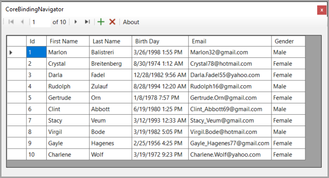

## No BindingNavigator for .NET Core

Microsoft Windows Forms .NET Core has no BindingNavigator so this solution presents the standard BindingNavigator exposed but has one issue which could not be fixed, adding the custom BindingNavigator to Visual Studio's toolbox (see this [issue](https://github.com/dotnet/winforms/issues/8208)).

This solution provides a work-around until Microsoft exposes the standard BindingNavigator.

In WinFormsApp1 the BindingNavigator in NavigatorLibrary is shown how to use with data created via NuGet package Bogus. A custom BindingList is used to permit sorting.

## Requires

- Microsoft Visual Studio 2022 or higher
- NET6 and NET8
